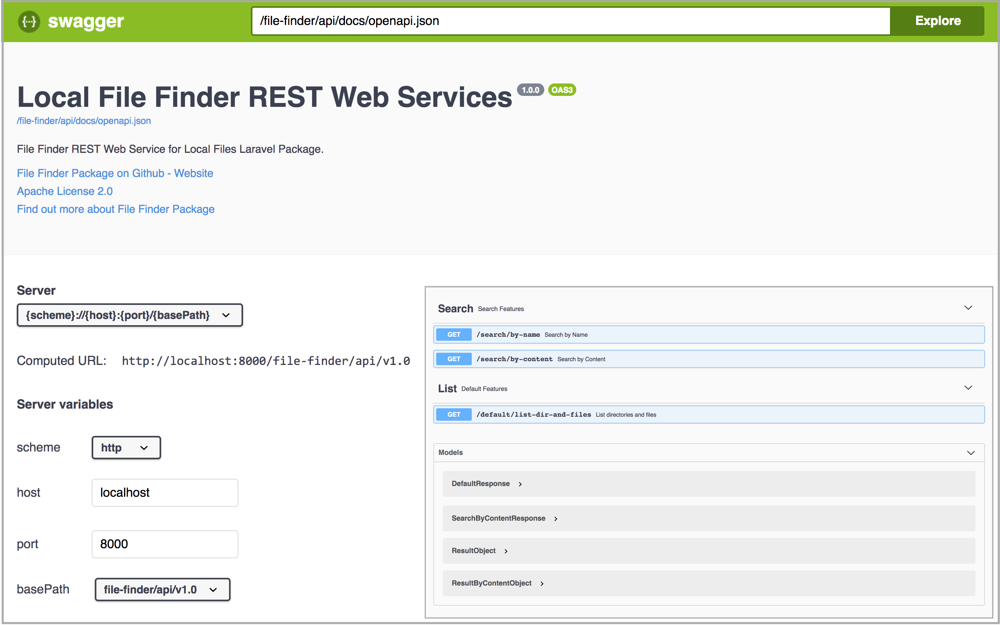

# Laravel Local File Finder Package
Laravel Local File Finder Package is a simple laravel package that allow finding a file by CONTENT (currently only for .txt file).

### Online Demo:

- [Laravel File Finder Online Demo](https://laravel-file-finder.mhs.web.id/file-finder/)

## Available Features:
- List default storage directories and files.
- Search files and directories By Name.
- Search files by Content.

## REST API Features
- [Swagger UI] (http://host:port/file-finder/api/docs)

## Installation

- Create Laravel Project

```bash
$ composer create-project --prefer-dist laravel/laravel laravel_file_finder_5.6_test "5.6.*"
```

- Add FileFinder Package

```bash
$ cd laravel_file_finder_5.6_test
$ composer require muharihar/file-finder
```

- Publish Assets and Default Data Samples

```bash
$ php artisan vendor:publish --tag=public --force
```

- Add FileFinder Service Provider to laravel application config (config/app.php)

```php
/*
* Package Service Providers...
*/

Muharihar\FileFinder\ServiceProviders\FileFinderServiceProvider::class,

```

- Running Application

```bash
$ php artisan serve
```

- Open Swagger UI for testing the features: http://127.0.0.1:8000/file-finder/api/docs

<p align="center">
  
</p>

### Test via CURL

#### 1. List default storage directories and files.

Command:

```bash
$ curl -v -X GET "http://localhost:8000/file-finder/api/v1.0/default/list-dir-and-files" -H "accept: application/json"
```

Sample Result: [sampleResponse](docs/samples/listDirAndFilesResponse.json)


#### 2. Search files and directories By Name.

Command:

```bash
$ curl -X GET "http://localhost:8000/file-finder/api/v1.0/search/by-name?s=b" -H "accept: application/json"
```

Sample Result:

```json
{
  "searchKey": "b",
  "results": [
    {
      "idx": 2,
      "isDir": true,
      "shortPath": "public/file-finder/folder_animals/folder_birds",
      "extension": "",
      "fileSize": 0,
      "parentPath": "public/file-finder/folder_animals"
    },
    {
      "idx": 12,
      "isDir": true,
      "shortPath": "public/file-finder/folder_fruits/folder_berries",
      "extension": "",
      "fileSize": 0,
      "parentPath": "public/file-finder/folder_fruits"
    },
    {
      "idx": 13,
      "isDir": false,
      "shortPath": "public/file-finder/folder_fruits/folder_berries/file_berries_list.txt",
      "extension": "txt",
      "fileSize": 44,
      "parentPath": "public/file-finder/folder_fruits/folder_berries"
    },
    {
      "idx": 26,
      "isDir": false,
      "shortPath": "public/file-finder/folder_geolocations/folder_cities/file_bg.txt",
      "extension": "txt",
      "fileSize": 633,
      "parentPath": "public/file-finder/folder_geolocations/folder_cities"
    }
  ],
  "resultCount": 4
}
```

#### 3. Search files by Content.

Command:

```bash
$ curl -X GET "http://localhost:8000/file-finder/api/v1.0/search/by-content?s=Obama" -H "accept: application/json"
```

Sample Result:
```json
{
  "searchKey": "Obama",
  "results": [
    {
      "idx": 41,
      "isDir": false,
      "shortPath": "public/file-finder/folder_peoples/folder_presidents/file_us.txt",
      "extension": "txt",
      "fileSize": 6713,
      "parentPath": "public/file-finder/folder_peoples/folder_presidents",
      "info": {
        "firstPos": 6580,
        "firstStr": "...Obama,http://en.wikipedia.org/wiki/Barack_Obama,20"
      }
    }
  ],
  "resultCount": 1
}
```